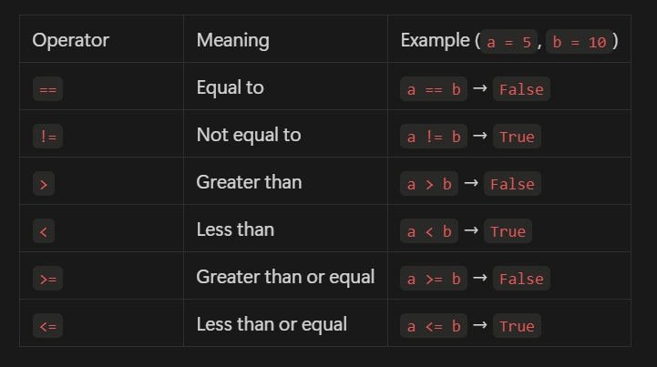
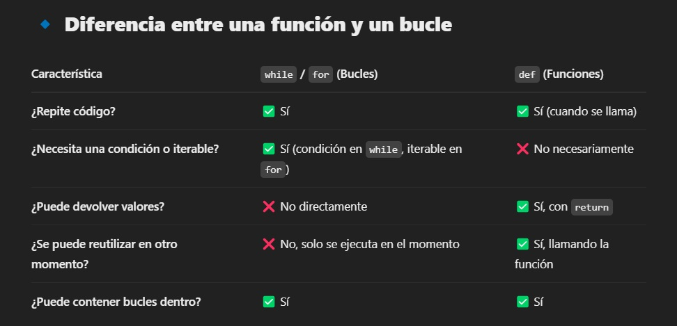

# Minuta Semana 2.

>## *Functions*
```
✅ Resumen: en el apartado de funciones vimos 
principalmente  la funcion "def" que nos permite dar un 
conjunto de instrucciones  y ehecutarse varias veces sin 
la necesidad de escribir el codigo varias veces.
```
**Function Declaration**
*def say_hello()
    print("Hello!")
say_hello()*

En este ejemplo vimos que usamos la funcion **def** sin ningún parametro dentro de los parentesis, aquí devuelve un **Hello** que tiene que ser llamado con el nombre de la funcion **say_hello**.

**Parameters**
*def greet(name):
    print(f"Hello, {name}!")
greet("Alice")  
Output: Hello, Alice!*

En este ejemplo usamos la función def con un parametro dentro del paréntesis , primeramente defininimos el nombre de la funcion **greet** con el parametro **name**, posteriomente mandamos a imprimir con un **f string: print(f"Hello, {name}!")** y por ultimo mandamos a llmar la función **greet** con el parametro **(name)**, para que me pueda imprimir el mensaje 

**Multiple Parameters**
def add(a, b):
    return a + b
result = add(3, 5)
print(result) 
Output: 8

Aqui lo mas importante fue ver que el def puede contener mas de 1 parametro y en este caso lo usamos para hacer una suma sencilla, lo mas importante de aqui es el **return** que indicará el comportamiento de los parametros en este caso se estan sumando: 

-*return devuelve el resultado de a + b.*
-*Luego, resultado = sumar(5, 3) almacena ese valor en resultado.*


**Return Statement**

**Scope**
Aquí vimos que hay dos tipos de variables **Locales** y **Globales**

- **local scope**: Las variables dentro de una función no son accesibles fuera de ella.
- **global scope**: Las variables declaradas fuera de cualquier función son accesibles en todas partes.

**Global vs. Local Scope**
Como ya sabemos las variables pueden ser locales o globales y las variables locales no pueden ser llamadas fuera de la funcion pero las variables globales si pueden ser llamadas dentro de una función 

*Ejemplo:*
x = 10 ----> **esta es la variable local**

def modify():
    global x
    x += 5

modify()
print(x) 
Output: 15

```
📕NOTA: para llamar a la variable Global tenemos que usar la palabra 
clave "global", con esta palabra llamamos la varble global a la 
función.

```


>## *Conditionals*
```
✅ Resumen: Aquí aprendimos a usar la condicional IF 
y sus diferentes estructuras como el "elif" y "else",
junto con los operadores de comparacion.
```

**Operadores de comparacion**


**If Statements**
La condicion if por si sola solo ejecuta el código cuando la condicion es **verdadera = True**

*Ejemplo:*
age = 18
if age >= 18:
    print("You are an adult.")

```
📕NOTA:Aquí vemos que la funcion se cumple porque age es mayor
o igual a 18 

```
**If Statement Scope**
**If-Else Statements**
Aqui vimos la funcion del **Else**, que da una segunda condición para que se cumpla el código, en este caso estamos diciendo que si la variable num es mayor a 0 imprima  "Positive number" si no se cumple y num es menor a 0 imprimirá "Non-positive number"

*num = 10
if num > 0:
    print("Positive number")
else:
    print("Non-positive number")*


**Else-If Statements**

Aqui vimos la condicion "elif" que basicamente se utiliza para hacer multiple condiciones:


**Logical Conditions (AND, OR, NOT)**
Aqui vimos las condiciones lógicas que vienen siendo "AND, OR, NOT", aqui segumos la misma lófica que los operadores matematicos booleanos

 - And: ambas coniciones tienes que ser iguales para que se cumplan, 
 (✅ TRUE=TRUE, FALSE= FALSE)
 (✖️ TRUE=FOLSE, FALSE=TRUE)
- OR:al menos una condicion tiene que se True para que funcione
- NOT:devuelve locontrario de los valores boolenaos(si es falso te devuelve un verdadero y si es  verdadero te devuelve un falso)

**Truthy and Falsey Values**
Aqui vimos los valores que se evaluan como "False" en las condiciones

False = False, None, 0, " " (empty string), [ ] (empty list), { } (empty dict)

>## *Loops*
```
✅ Resumen: En el apartado de Loops vimos principalmente 
los bucles "While" y "for" que se utilizan para repetir 
varias veces los bloques de códigos.
```
```
📕NOTA: El while y for no son funciones, sino estructuras 
de control, no confundir los bucles con las funciones
```
Diferenias principales:


<!-- En la terminal de Anaconda:
```bash
conda create -n onboarding-pandas python=3.12
```


```bash
 conda activate onboarding-pandas
```
## Paso #2
```
pip install pandas 
```
```
pip freeze > requirements.txt
```

```

├── code
│   ├── src
│   │   ├── main.py
│   │   ├── utils
│   │   │    ├── helper.py
│   │ readme.md
|   | requirements.txt
``` -->
